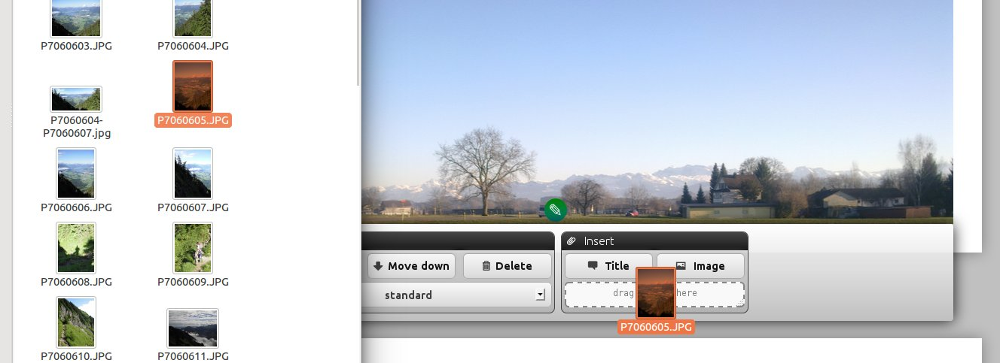
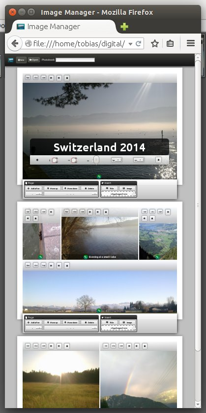
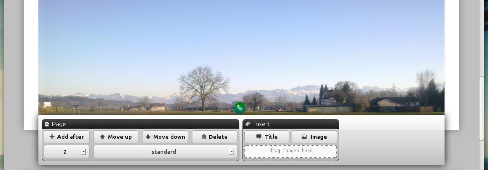
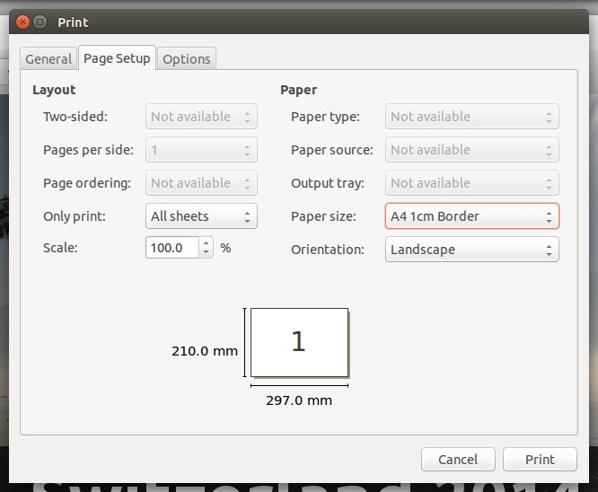

Photobook
=========

"Photobook" is an HTML5 Application to create a photobook using the printer function of the browser.

Print with Firefox
------------------

1. about:config -> margin. Set margin_left, margin_right, margin_bottom, margin_top to 0.
2. "Firefox Menu"->"Print"->"Page Setup"->"Custom Size".
3. Create a Page with Size of A4 and Border 1cm. The print layout will remove the white border so the pdf printer can add it.
4. Print with "Print to file". Uncheck "Ignore Size and shrink...", allow printing background images and remove all headers and titles. Use a landscape paper of the type you created above.

Compile from source
-------------------

### Styles

	lessc ./Resources/Styles/styles.less ./Resources/Styles/styles.css

	
### TypeScript

	tsc --target ES5 ./Main.ts --module AMD