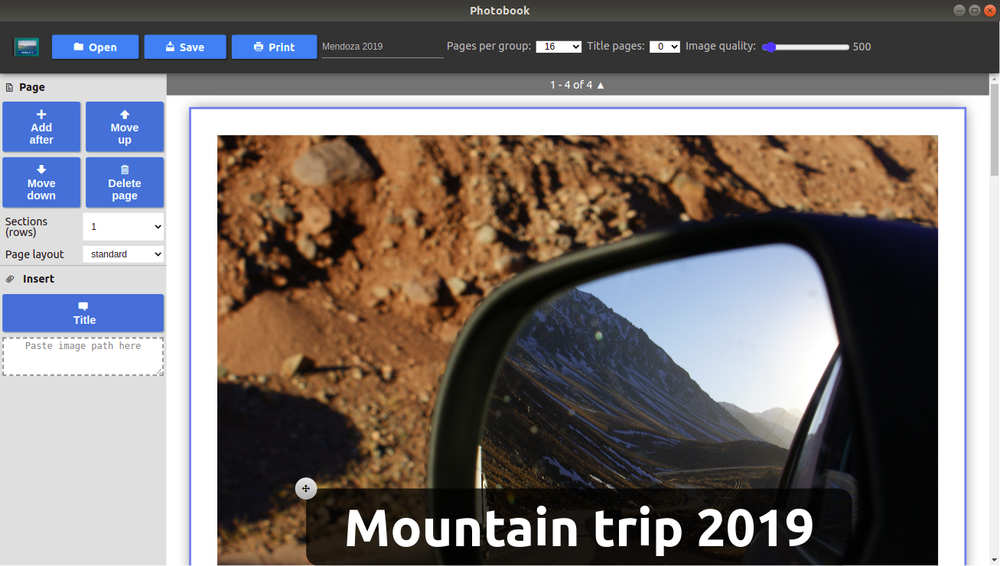

# Photobook

"Photobook Editor" is an Electron and Angular based Application to create photobooks.




## Installation

### Linux (Appimage/Snap)

Download installation package of the [latest release](https://github.com/moonline/Photobook/releases).

#### Create application launcher

1. Copy AppImage file to `.local/bin/photobook-editor.AppImage` in your home directory.

```sh
cp photobook-editor-*.AppImage ~/.local/bin/photobook-editor.AppImage
```

2. Make it executable 

```sh
sudo chmod+x ~/.local/bin/photobook-editor.AppImage
```

3. Copy the launcher `photobook-editor.desktop` to `.local/share/applications/`.

```sh
cp photobook-editor.desktop ~/.local/share/applications/
```


## Uninstall

Remove appimage and launcher:

```sh
rm ~/.local/share/applications/photobook-editor.desktop
rm ~/.local/bin/photobook-editor.AppImage
```

## Development

See [Photobook Editor > Development](./photobook-editor/README.md)


## License

<a rel="license" href="http://www.gnu.org/copyleft/gpl.html"></a><br />This work is licensed under the <a rel="license" href="http://www.gnu.org/licenses/gpl-3.0-standalone.html">GNU GENERAL PUBLIC LICENSE 3.0</a>
