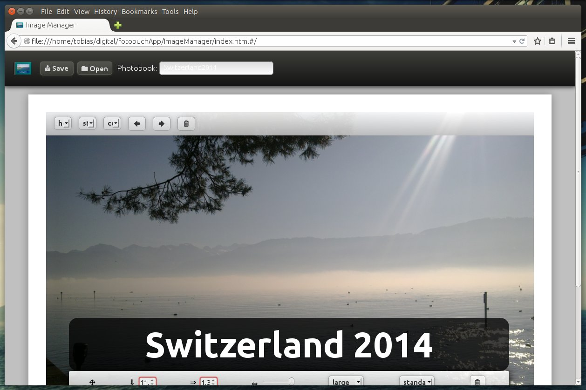
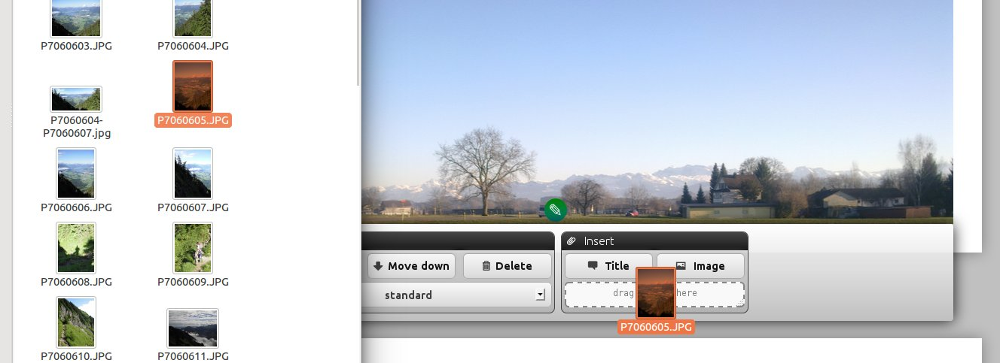
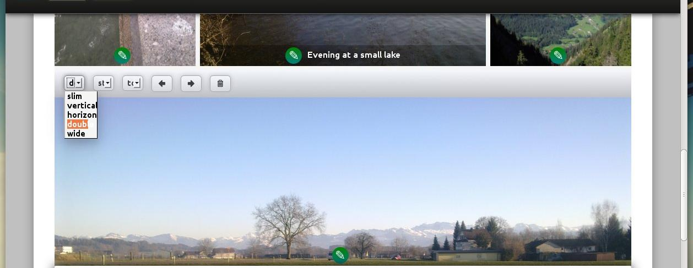
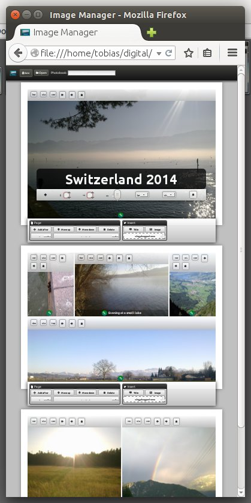
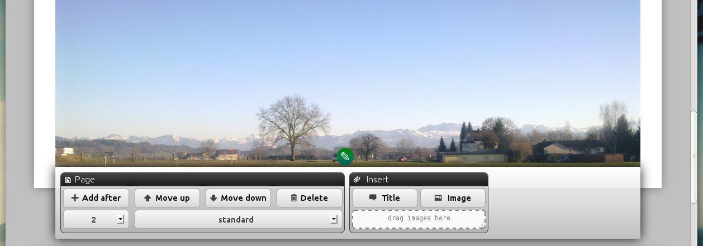
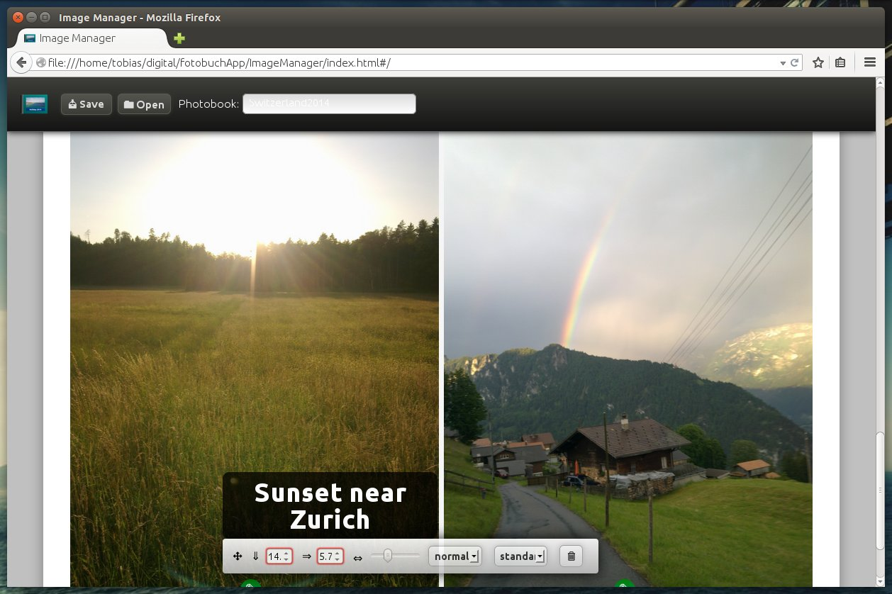
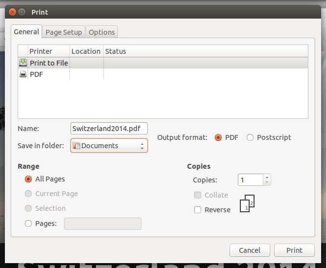
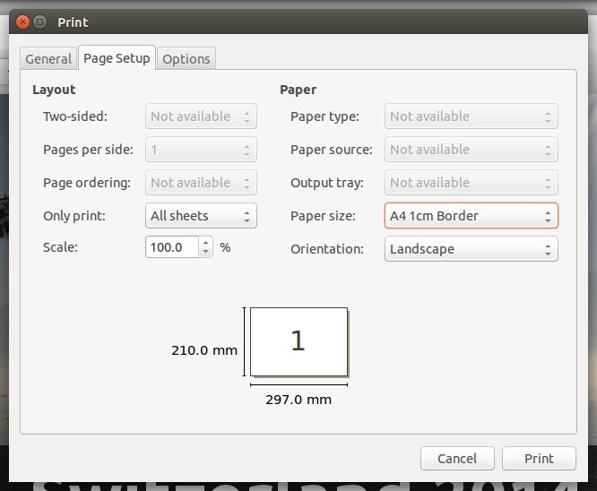
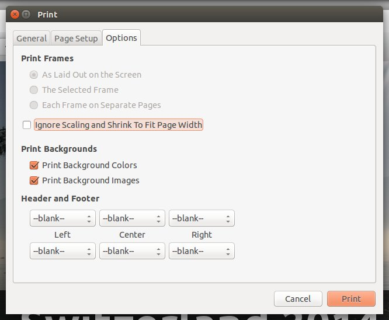

# Photobook

"Photobook Editor" is an HTML5 Application to create a photobook using the printer function of the browser.















## Install the application

See section Development


## Usage

### Print with Firefox

1. about:config -> margin. Set margin_left, margin_right, margin_bottom, margin_top to 0.
2. "Firefox Menu"->"Print"->"Page Setup"->"Custom Size".
3. Create a Page with Size of A4 and Border 1cm. The print layout will remove the white border so the pdf printer can add it.
4. Print with "Print to file". Uncheck "Ignore Size and shrink...", allow printing background images and remove all headers and titles. Use a landscape paper of the type you created above.






## Development

### Environment

Install:

* [Node.js](https://nodejs.org/en/download/)
* [Yarn](https://classic.yarnpkg.com/en/docs/install)
* ImageMagick: `sudo apt install imagemagick`


### Install dependencies

```sh
cd photobook-editor
yarn install
```

### Build

```sh
yarn build
```


### Start the application

```sh
yarn start
```

Open [localhost:8080/index.html](http://localhost:8080/index.html)` in your webbrowser.


### Compile styles by hand

```sh
lessc ./Resources/Styles/styles.less ./Resources/Styles/styles.css
```


### Compile TypeScript by hand

```sh
tsc --target ES5 ./Main.ts --module AMD --out ./Main.js
```


## Version history

Version | 			| Dependencies							| Features
---		|---		|---									|---
0.1		| Alpha 1	| &bull; node: 10.25<br />&bull; tsc: 1.0<br />&bull; lessc: 2.2		| &bull; insert images & titles<br />&bull; save & load files
0.2 	| Alpha 2	| &bull; node: 10.25<br />&bull; tsc: 1.0<br />&bull; lessc: 2.2		| &bull; add parts for better performance<br />&bull; refactor code
0.3 	| Alpha 3	| &bull; node: 10.25<br />&bull; tsc: 1.0<br />&bull; lessc: 2.2		| &bull; add title page before parts<br />&bull; refactor code
0.4 	| Alpha 4	| &bull; node: 10.25<br />&bull; tsc: 1.0<br />&bull; lessc: 2.2		| &bull; add image thumbnail api<br />&bull; material design<br />&bull; image controls sidebar<br />&bull; title controls sidebar
